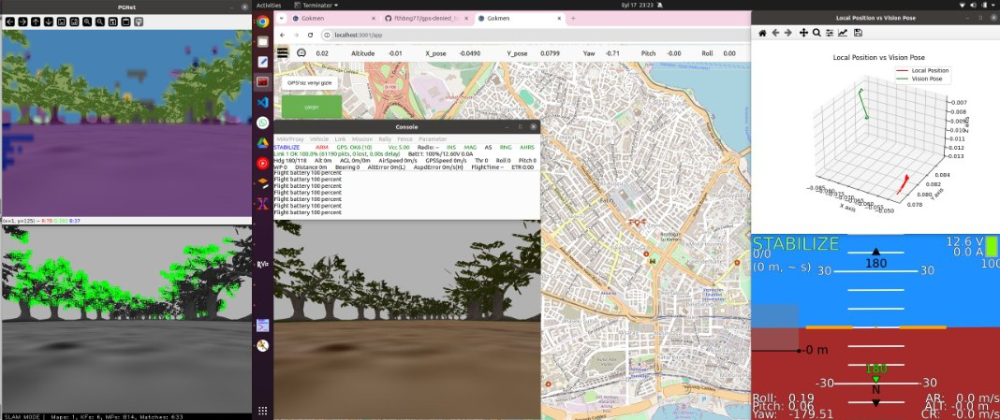

# Websocket_with_Ros
Preparing websocket using react, node.js, flask and ros

Kendi ürettiğimiz araçlarımızın yer kontrol istasyon arayüzü, aracımızdan gelen anlık telemetri verisi kamera görüntüsü ve haritada konumunu anlık olarak gösterirken kameradan gelen görüntüleri yapay zeka modeli kullanarak çıkarım yapmaktadır.

Arayüzün Yapay zeka ekranları ve Uçuş bilgilerini elde edeceğimiz HUD ekranları ile kullanımı:

